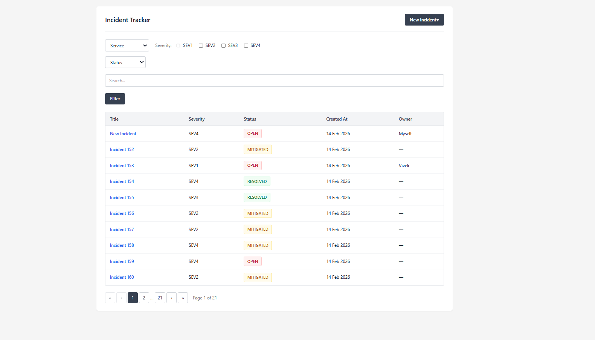
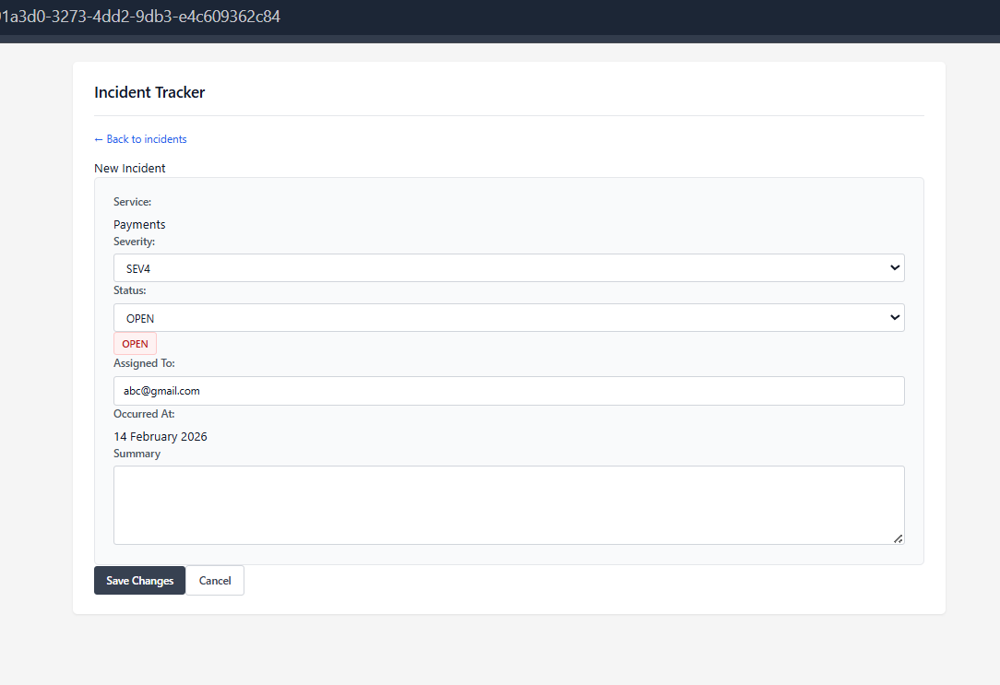
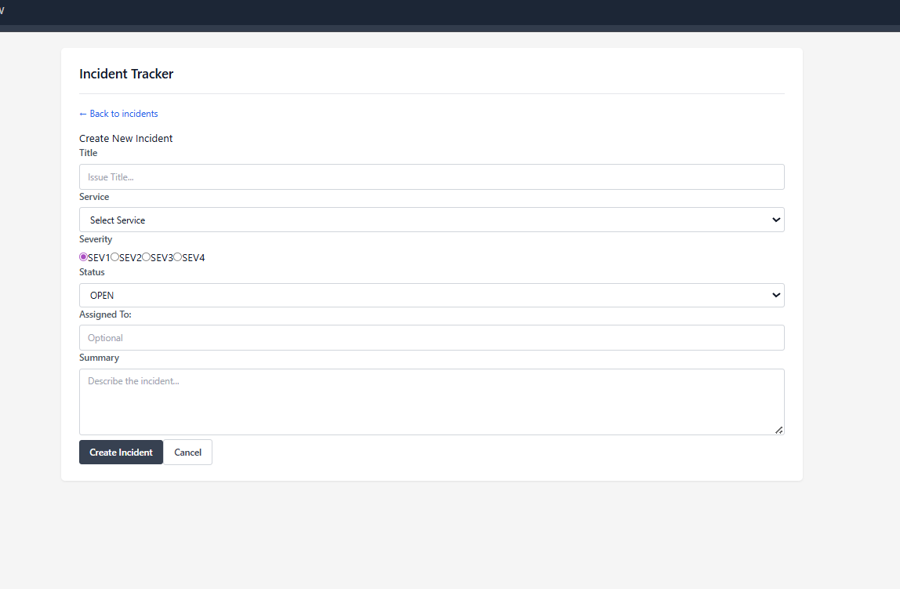

# Incident Management Dashboard

A full-stack Incident Management Dashboard built as part of a Software Engineer assignment.  
The system allows teams to create, view, track, and update incidents across multiple services with clear severity and lifecycle states.

The project focuses on clean API design, predictable frontend behavior, and practical engineering decisions.

---

## UI Screenshots

### Incident Listing Page


### Incident Detail Page


### Incident Creation


---

## Features

### Core
- Create incidents via REST API
- List incidents with pagination
- View incident details
- Update incident status (OPEN → MITIGATED → RESOLVED)
- API-based data seeding

### Frontend
- Incident table view
- Detail page for each incident
- Status update actions
- Loading and empty states
- Responsive UI with Tailwind CSS

### Backend
- RESTful API with FastAPI
- SQLite database (auto-created)
- SQLAlchemy ORM
- Enum-based severity and status
- CORS enabled for frontend

---

## Tech Stack

### Backend
- Python
- FastAPI
- SQLAlchemy
- SQLite
- Pydantic

### Frontend
- React
- Vite
- TypeScript
- Tailwind CSS
- React Router

---

## Project Structure

```

Zeotap_assignment/
│
├── backend/
│   ├── app/
│   │   ├── **init**.py
│   │   ├── main.py
│   │   ├── database.py
│   │   ├── models.py
│   │   ├── schemas.py
│   │   ├── seed.py
│   │   ├── routers/
│   │   │   ├── **init**.py
│   │   │   └── incidents.py
│   │   └── utils/
│   ├── requirements.txt
│   └── smartenv/
│
└── frontend/
├── index.html
├── package.json
├── vite.config.ts
├── tailwind.config.js
├── postcss.config.js
└── src/
├── api/
│   └── incidents.ts
├── components/
│   └── IncidentTable.tsx
├── pages/
│   ├── IncidentListPage.tsx
│   └── IncidentDetailPage.tsx
├── App.tsx
└── main.tsx

````

---

## Backend Setup

### 1. Create and activate virtual environment

```bash
cd backend
python -m venv smartenv
source smartenv/bin/activate      # Windows: smartenv\Scripts\activate
````

### 2. Install dependencies

```bash
pip install -r requirements.txt
```

### 3. Run the backend server

```bash
uvicorn app.main:app --reload
```

Backend URL:

```
http://127.0.0.1:8000
```

Swagger Docs:

```
http://127.0.0.1:8000/docs
```

---

## Database

* SQLite is used for simplicity
* Database file is created automatically on first run
* No external database installation required

---

## Seeding Data

Seed sample incidents using API-based seeding:

```bash
python app/seed.py
```

This sends POST requests to the backend instead of inserting directly into the database.

---

## Frontend Setup

### 1. Install dependencies

```bash
cd frontend
npm install
```

### 2. Start development server

```bash
npm run dev
```

Frontend URL:

```
http://localhost:5173
```

---

## Usage Flow

1. Open the frontend in the browser
2. View list of incidents
3. Click on any incident to open detail page
4. Update incident status
5. Navigate back to the list

---

## API Endpoints

| Method | Endpoint                   | Description            |
| ------ | -------------------------- | ---------------------- |
| POST   | /api/incidents             | Create incident        |
| GET    | /api/incidents             | List incidents         |
| GET    | /api/incidents/{id}        | Incident details       |
| PATCH  | /api/incidents/{id}/status | Update incident status |

---

## Deployment

### Backend

* Deployable on Render, Railway, EC2, etc.
* Replace SQLite with PostgreSQL for production
* Use Gunicorn with Uvicorn workers

### Frontend

* Build with:

```bash
npm run build
```

* Deploy `dist/` folder to Netlify or Vercel

---

## Design Decisions

* SQLite chosen for zero-setup evaluation
* Enum-based status and severity to prevent invalid states
* Authentication and RBAC intentionally excluded
* Focus on clarity, maintainability, and correctness

---

## Design Decisions & Tradeoffs

- **SQLite over PostgreSQL**  
  SQLite was chosen to keep setup friction minimal and ensure the project runs out-of-the-box for evaluation. The tradeoff is limited concurrency and scalability, which would be addressed by switching to PostgreSQL in a production environment.

- **API-driven data seeding**  
  All seed data is created via API calls instead of direct database inserts. This ensures consistency with real-world usage and validates API correctness, at the cost of slightly slower initial data population.


---
## Future Enhancements

* Authentication and roles
* Different Admin and User access
* Updated by flag for transperancy
* Organization or Team based isolated systems for better
* Overall performance Dashboards
---

## Author

Vivek Dubey
Software Engineer

```
